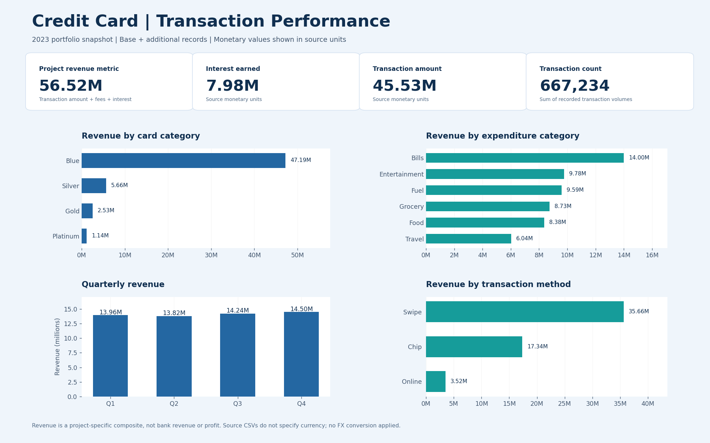
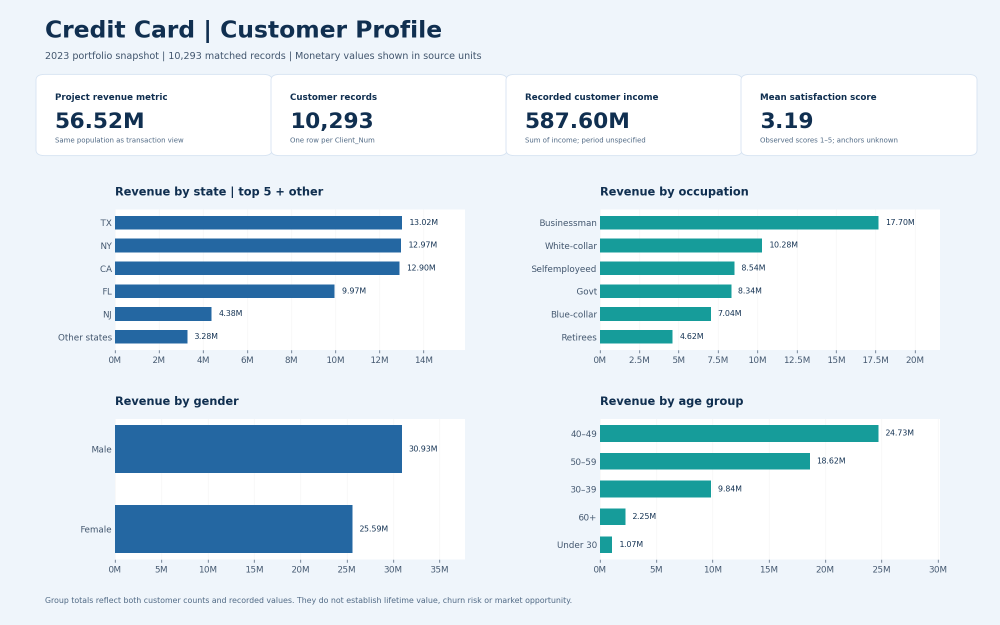

# Credit Card Financial Dashboard

A portfolio project exploring card usage, recorded financial amounts and customer segments in a **2023 credit-card dataset**. The corrected analysis combines the base and additional files, validates a one-to-one customer join, and reconciles **10,293 records**.

## Dashboard previews

### Transaction performance



### Customer profile



This originated as a Power BI portfolio project. **The current PNGs and PDFs are static previews regenerated with Python/Matplotlib from the included CSVs.** The original editable Power BI model is not included; these files do not provide interactive slicers or prove the original DAX implementation.

## Verified results

| Measure | Result | Meaning |
|---|---:|---|
| Matched records | 10,293 | Distinct `Client_Num` after appending both update files |
| Project revenue metric | 56,517,010.81 | Transaction amount + annual fees + interest earned |
| Transaction amount | 45,533,021 | Sum of `Total_Trans_Amt` |
| Interest earned | 7,982,479.81 | Sum of `Interest_Earned` |
| Transaction count | 667,234 | Sum of transaction-volume fields, not CSV row count |
| Recorded customer income | 587,599,783 | Sum of `Income`; income period is not specified |
| Mean satisfaction score | 3.19 | Unweighted customer-record average |

**Currency:** The source CSVs do not identify a currency. All monetary values therefore use source units, without a £ or $ symbol and without currency conversion. Earlier README/report versions used inconsistent symbols.

**Revenue definition:** This is a project-specific composite used to reconcile the original dashboard, not recognised bank revenue, net income or profit. Customer transaction spending is not automatically revenue earned by the issuer.

## Business findings

- **Blue cards contribute 47.19M** to the project revenue metric, approximately **83.5%** of its total. This describes concentration in the dataset; it does not prove that Blue cards are more profitable or riskier.
- **Bills is the largest expenditure category**, contributing approximately **14.00M** to the same metric. Category revenue is not transaction frequency or a causal explanation of spending.
- **Q4 has the highest recorded quarterly project revenue, approximately 14.50M.** The dataset alone does not establish a holiday effect or margin expansion.
- Customer groups can be compared by recorded totals, but differences also reflect their sizes. Compare per-customer values and additional outcomes before making targeting or retention decisions.
- Scores range from **1 to 5 in the supplied records**; the mean is **3.19**. The source does not document the response labels, survey method or benchmark. It is not sufficient evidence of dissatisfaction or churn risk.

## Data preparation and model

1. Read `credit_card.csv` (**10,108 rows**) and `cc_add.csv` (**185 rows**).
2. Rename update-file `Total_Trans_Ct` to `Total_Trans_Vol` before appending. Without this step, transaction counts could be understated.
3. Append `customer.csv` (**10,108 rows**) and `cust_add.csv` (**185 rows**).
4. Check that `Client_Num` is unique on both sides and the customer-ID sets match.
5. Join on `Client_Num` with a **one-to-one validation**; the resulting dataset has **10,293 rows**, so the join does not multiply the population.
6. Parse `Week_Start_Date` as day-month-year. Dates span 1 January–31 December 2023.
7. Calculate the project revenue metric and group the matched rows for each visual.

The credit-card CSV has one record per client in this snapshot and includes aggregated transaction amounts and counts. It is **not an individual-transaction event log**. Its weekly reporting field should not be interpreted as a date for every underlying purchase.

The customer preview uses age bands **under 30, 30–39, 40–49, 50–59 and 60+**. Its state chart shows the top five states plus an explicit “Other states” group so totals remain complete.

## Calculation example

Equivalent DAX for a table named `CreditCard` after appending the files:

```dax
Project Revenue =
    SUM(CreditCard[Total_Trans_Amt])
    + SUM(CreditCard[Annual_Fees])
    + SUM(CreditCard[Interest_Earned])

Transaction Count = SUM(CreditCard[Total_Trans_Vol])
```

These are documented equivalent definitions, not recovered measures from the unavailable original Power BI model. The executed calculations are inspectable in [rebuild_preview.py](rebuild_preview.py).

## Reproduce the outputs

```bash
python -m pip install -r requirements.txt
python rebuild_preview.py
python build_insights_report.py
```

The first script rebuilds the static dashboards, checks the join, and writes the metric/segment summaries. The second rebuilds the concise insights PDF from those summaries.

## Project files

- [Transaction report PDF](Credit_Card_Transaction_Report.pdf)
- [Customer report PDF](Credit_Card_Report_Customer.pdf)
- [Insights report PDF](Credit_Card_Professional_Insights_Report.pdf)
- [Verified metric summary](verified_metrics.json)
- `summary_*.csv` — results by card category, quarter, state, job, expenditure and gender
- `credit_card.csv`, `customer.csv`, `cc_add.csv`, `cust_add.csv` — original supplied records
- `rebuild_preview.py`, `build_insights_report.py`, `requirements.txt` — reproducible calculations and rendering

## Scope and limitations

The supplied files do not document their original publisher, licence, sampling process or whether the records are synthetic. Findings describe this portfolio dataset only. They do not establish customer lifetime value, an addressable market gap, profitability, credit risk or causal effects. The revised insights report removes those unsupported claims.

## Skills demonstrated

Data validation · Schema alignment · Join checks · Aggregation · Customer segmentation · Metric documentation · Reproducible analysis · Dashboard presentation

**Vaibhav Panchal**
